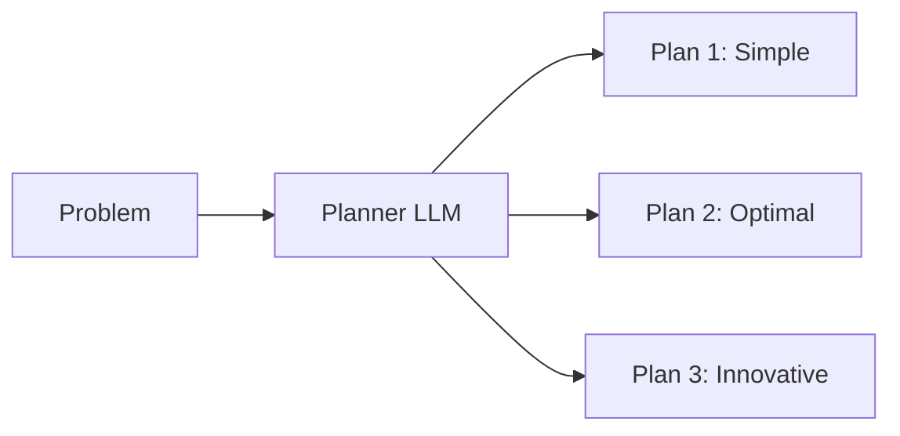
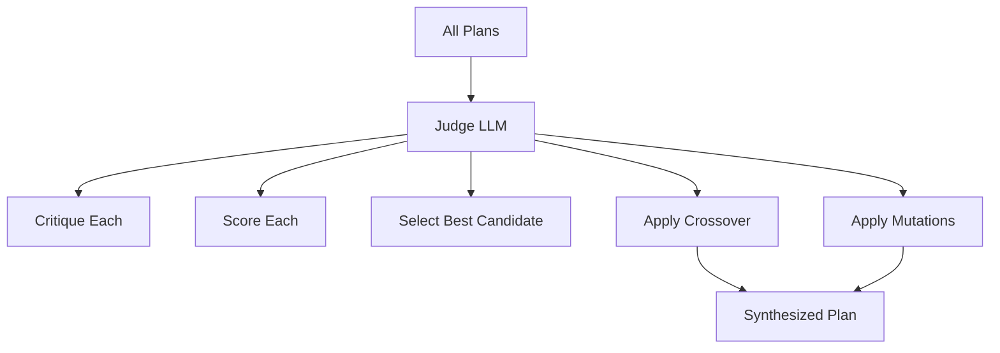

# ReasonForge

A sophisticated web application that implements an evolutionary reasoning workflow using multiple LLM roles: **Planner**, **Judge**, and **Chat**.

## Features

- 🎯 **Planner LLM**: Generates 3 distinct solution plans with trade-off analysis
- ⚖️ **Judge LLM**: Evaluates plans using evolutionary reasoning (crossover, mutation)
- ✨ **Synthesized Plan**: Judge generates optimized plan combining best aspects of all candidates
- 💬 **Chat Interface**: Iterative refinement of the synthesized best plan
- 🔌 **Multi-Provider Support**: Works with OpenAI, OpenRouter, Ollama, Groq, and more
- ⚡ **Streaming Responses**: Real-time token streaming with asyncLLM for instant feedback
- 🎨 **Efficient Rendering**: Uses lit-html for minimal DOM updates
- 🧪 **Partial JSON Parsing**: Renders incomplete results as they stream in
- 🎯 **Separate Models**: Choose different models for Planner and Judge
- 🔍 **GPT-4/5 Filter**: Only shows gpt-4.* and gpt-5.* models
- 🌐 **Custom Proxies**: Text input for base URL supports any proxy
- 💾 **Persistent Settings**: API keys and model selections saved to localStorage

## Architecture

### Technology Stack

- **Frontend**: Vanilla JavaScript (ES modules)
- **Rendering**: [lit-html](https://lit.dev/) - Efficient, declarative templates
- **Styling**: Bootstrap 5 (no custom CSS)
- **LLM Integration**: 
  - [bootstrap-llm-provider](https://github.com/sanand0/bootstrap-llm-provider) - Multi-provider configuration
  - [asyncLLM](https://www.npmjs.com/package/asyncllm) - Streaming LLM responses
  - [partial-json](https://www.npmjs.com/package/partial-json) - Parse incomplete JSON
- **API**: Chat Completions API (`/v1/chat/completions`) with streaming support

### Project Structure

```
reasonforge/
├── index.html              # Main HTML file
├── script.js               # Entry point (imports modules)
├── js/                     # Modular JavaScript (~840 lines total, DRY)
│   ├── llm-service.js      # LLM configuration & API calls (287 lines)
│   ├── renderers.js        # lit-html rendering logic (202 lines)
│   └── ui-controller.js    # UI interactions & workflow (348 lines)
├── prompts/                # System prompts (markdown)
│   ├── planner.md          # Planner LLM prompt
│   ├── judge.md            # Judge LLM prompt
│   └── chat.md             # Chat LLM prompt
├── app.md                  # Original specification
└── README.md               # This file
```

### Module Architecture

**Separation of Concerns:**

| Module | Responsibility | Lines | Key Functions |
|--------|----------------|-------|---------------|
| `llm-service.js` | LLM API layer | 287 | `configureLLMProvider()`, `callPlannerLLM()`, `callJudgeLLM()`, `callChatLLM()` |
| `renderers.js` | Pure rendering | 202 | `renderPlans()`, `renderJudgeResults()`, `renderScoreBadge()` |
| `ui-controller.js` | UI orchestration | 348 | `generateAndEvaluate()`, `sendChatMessage()`, `init()` |
| `script.js` | Entry point | 10 | Imports ui-controller |

**Design Principles:**
- ✅ **DRY**: No repeated code, shared utilities extracted
- ✅ **Single Responsibility**: Each module has one clear purpose
- ✅ **Loose Coupling**: Modules communicate via clean interfaces
- ✅ **High Cohesion**: Related functionality grouped together
- ✅ **ES Modules**: Modern import/export syntax
- ✅ **Pure Functions**: Rendering functions are side-effect free

**Module Dependencies:**

```
script.js (Entry)
    └── ui-controller.js (Orchestration)
            ├── llm-service.js (API & State)
            │   ├── asyncllm (Streaming)
            │   ├── partial-json (Parsing)
            │   └── bootstrap-llm-provider (Config)
            └── renderers.js (Pure UI)
                └── lit-html (Templates)
```

**Data Flow:**

```
User Input → ui-controller → llm-service → LLM API
                ↓                              ↓
          renderers ← ← ← ← ← ← ← ← Streaming Response
                ↓
            Browser DOM
```

### Why lit-html?

lit-html provides several benefits over manual HTML string manipulation:

1. **Memory Efficient**: Only updates DOM nodes that changed
2. **Performance**: Faster re-renders with minimal overhead
3. **Security**: Automatic XSS protection (except with `unsafeHTML`)
4. **Developer Experience**: Clean template literal syntax
5. **No Virtual DOM**: Direct DOM updates with intelligent diffing

Example:

```javascript
// Before (string concatenation)
html = `<div>${escapeHtml(data)}</div>`;
container.innerHTML = html;

// After (lit-html)
const template = html`<div>${data}</div>`;  // Auto-escaped
render(template, container);  // Only updates what changed
```

### Streaming with asyncLLM

The app uses [asyncLLM](https://www.npmjs.com/package/asyncllm) for real-time token streaming


**Benefits:**
- **Instant Feedback**: See results as they're generated
- **Better UX**: No waiting for complete responses
- **Partial JSON**: Plans/evaluations render progressively using `partial-json`
- **Error Recovery**: Graceful handling of incomplete responses

## Getting Started

### Prerequisites

- Modern web browser with ES module support
- API key from one of the supported providers:
  - [OpenAI](https://platform.openai.com/)
  - [OpenRouter](https://openrouter.ai/) (recommended - access to many models)
  - [Ollama](https://ollama.ai/) (local, free)
  - [Groq](https://groq.com/)
  - Others (Mistral AI, Together AI, etc.)

### Setup

1. **Clone or download this repository**

2. **Serve the files**:
   ```bash
   # Using Python
   python -m http.server 8000
   
   # Using Node.js
   npx serve .
   
   # Using PHP
   php -S localhost:8000
   ```

3. **Open in browser**: `http://localhost:8000`

4. **Configure LLM Provider**:
   - Click the "Settings" button
   - Select or enter your provider's base URL (supports custom proxies)
   - Enter your API key
   - The app will fetch available models and save configuration to localStorage

5. **Select Models** (optional):
   - Choose separate models for Planner and Judge LLMs
   - Only gpt-4.* and gpt-5.* models are shown
   - Selections are persisted to localStorage

6. **Start reasoning**:
   - Enter a problem statement
   - Click "Generate Plans"

## Usage

### 1. Enter Problem Statement

Describe your coding, algorithmic, or system design challenge:

```
Design a scalable real-time chat system that can handle 
1 million concurrent users with minimal latency and 
guaranteed message delivery.
```

### 2. Review Plans

The Planner generates 3 distinct approaches, each with:
- Summary and steps
- Assumptions and trade-offs
- Scores (correctness, efficiency, complexity, maintainability)

### 3. Judge Evaluation

The Judge critiques each plan and:
- Identifies strengths and weaknesses of each candidate
- Suggests mutations (targeted improvements)
- Proposes crossover (combining best aspects)
- **Generates a synthesized "best plan"** that combines the strongest elements from all candidates

The synthesized plan includes:
- **Approach**: High-level strategy
- **Steps**: Detailed implementation steps
- **Key Decisions**: Critical choices and rationale
- **Trade-offs Resolved**: How conflicting priorities were addressed
- **Expected Outcomes**: Success criteria
- **Implementation Notes**: Practical guidance

### 4. Refine via Chat

Engage in conversation to:
- Request implementation details
- Adjust trade-offs
- Generate code snippets
- Explore alternative approaches

## Customization

### Edit Prompts

All system prompts are in `prompts/*.md` for easy editing:

```markdown
prompts/planner.md   # Controls plan generation
prompts/judge.md     # Controls evaluation criteria
prompts/chat.md      # Controls chat behavior
```

Changes take effect after page reload.

### Modify UI Colors

Edit the gradient colors in `index.html`:

```html
<!-- Problem Section -->
<div class="card-header bg-gradient" 
     style="background: linear-gradient(135deg, #667eea 0%, #764ba2 100%);">

<!-- Plans Section -->
style="background: linear-gradient(135deg, #4facfe 0%, #00f2fe 100%);">

<!-- Judge Section -->
style="background: linear-gradient(135deg, #fa709a 0%, #fee140 100%);">

<!-- Chat Section -->
style="background: linear-gradient(135deg, #43e97b 0%, #38f9d7 100%);">
```

### Add More Providers

Update `DEFAULT_BASE_URLS` in `script.js`:

```javascript
const DEFAULT_BASE_URLS = [
    { url: "https://api.example.com/v1", name: "My Provider" },
    // ... existing providers
];
```

## How It Works

### 1. Planner Phase



### 2. Judge Phase



### 3. Evolutionary Reasoning

The Judge applies evolutionary concepts to create a **superior synthesized plan**:

- **Population**: Multiple diverse candidate plans (from Planner)
- **Fitness Evaluation**: Scoring each candidate on multiple criteria
- **Selection**: Identify the best base candidate
- **Crossover**: Combine strengths from multiple plans (e.g., "Use Plan 1's caching strategy + Plan 2's error handling")
- **Mutation**: Apply targeted improvements to fix identified weaknesses
- **New Generation**: Output a synthesized plan that's better than any individual candidate

**Example Evolution:**
- Plan 1: Simple but slow (60% score)
- Plan 2: Fast but complex (70% score)  
- Plan 3: Memory-efficient but risky (65% score)
- **Synthesized**: Fast (from Plan 2) + Simple patterns (from Plan 1) + Memory-efficient (from Plan 3) = **85% score**

### 4. Chat Phase

Continuous refinement loop:

```
User Query → Chat LLM (with context) → Response → Refined Understanding
    ↑                                                      ↓
    └──────────────────────────────────────────────────────┘
```

## Performance

- **Initial Load**: ~100-200ms (CDN-hosted dependencies)
- **Prompt Loading**: ~50ms (3 small markdown files)
- **API Calls**: Depends on provider and model
- **DOM Updates**: ~5-10ms (lit-html efficient diffing)
- **Memory**: Minimal overhead from lit-html templates

## Browser Support

- Chrome/Edge: ✅ (90+)
- Firefox: ✅ (90+)
- Safari: ✅ (14+)
- Opera: ✅ (76+)

Requires ES modules and import maps support.

## Configuration & Data Persistence

### localStorage Keys

The app stores configuration in your browser's localStorage:

| Key | Purpose | Data Stored |
|-----|---------|-------------|
| `reasonforge_llm_config` | LLM provider settings | Base URL, API key, available models |
| `reasonforge_model_selection` | Model preferences | Selected Planner and Judge models |

### Data Privacy

- **All data stays local**: API keys and settings are stored in browser localStorage only
- **No server tracking**: This is a client-side only application
- **Private conversations**: Chat history is in-memory and cleared on page refresh
- **Secure by default**: Configure your own LLM provider, no third-party intermediary

### Clearing Settings

To reset all configuration:

```javascript
// Open browser console (F12) and run:
localStorage.removeItem("reasonforge_llm_config");
localStorage.removeItem("reasonforge_model_selection");
// Refresh the page
```

## Troubleshooting

### "Failed to load prompts"

- Ensure you're serving files via HTTP/HTTPS (not `file://`)
- Check browser console for CORS errors
- Verify `prompts/*.md` files exist

### "LLM provider not configured"

- Click Settings and configure a provider
- Check API key validity
- Verify provider URL is correct

### Plans not generating

- Check browser console for errors
- Verify model supports JSON output
- Try a different model (e.g., GPT-4)

### Tooltips not showing

- Tooltips initialize after render
- Check Bootstrap JS is loaded
- Verify `data-bs-toggle="tooltip"` attributes

## Contributing

1. Fork the repository
2. Create a feature branch
3. Make your changes
4. Test thoroughly
5. Submit a pull request

## License

ReasonForge is released under the [MIT License](./LICENSE).

```
MIT License © 2025 Prudhvi
Permission is granted to use, copy, modify, merge, publish, distribute,
sublicense, and/or sell copies of this software, provided the copyright
notice and this permission notice appear in all copies.
```

## Acknowledgments

- [lit-html](https://lit.dev/) - Efficient templating library
- [bootstrap-llm-provider](https://github.com/sanand0/bootstrap-llm-provider) - Multi-provider LLM configuration
- [Bootstrap 5](https://getbootstrap.com/) - UI framework
- OpenAI and other LLM providers for their APIs

## Roadmap

- [x] Persistent configuration (localStorage)
- [ ] Save/load conversation sessions
- [ ] Export plans as markdown/PDF
- [ ] Multiple iterations (generation N → feedback → generation N+1)
- [ ] Visualization of plan evolution
- [ ] Custom scoring criteria
- [ ] Plan comparison view
- [ ] Collaborative mode (multiple users)
- [ ] Integration with code editors

---

